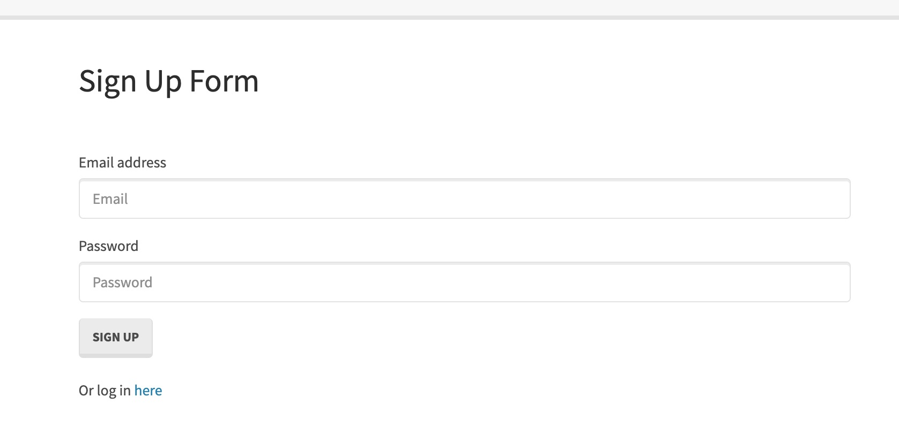

# Sequelize: Reverse Engineering Code

The assignment will demonstrate the reverse engineer of the the starter code for a Sign Up Form Application which is provided under the Develop Folder.

The code was inspected and an explanation in the format of a Google Document breaks down each file's responsibility and dependencies if there are any.

## User Story
As a developer

I want a walk-through of the codebase

So that I can use it as a starting point for a new project.

## Technology
Node.js

Npm Packages: 
 - express
 - express-session
 - mysql2
 - passport
 - passport-local
 - sequalize

## Links
https://docs.google.com/document/d/1G-CxSzXLthX6pixhaNgJ8KBI1yrMbEDtD8PNrMHtWPI/edit?usp=sharing